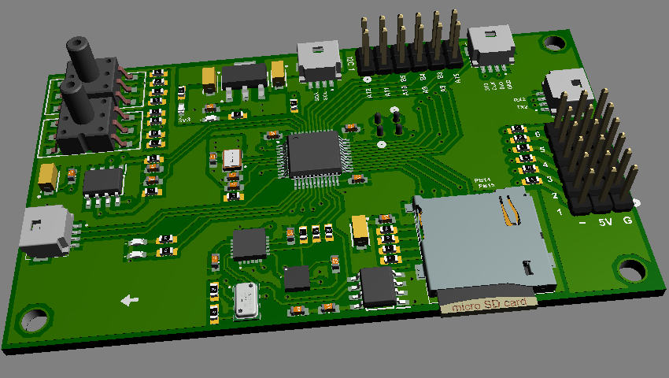
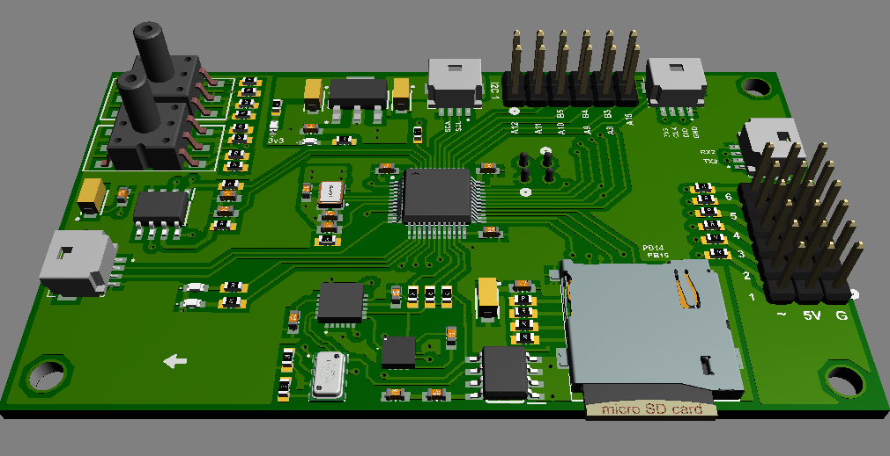
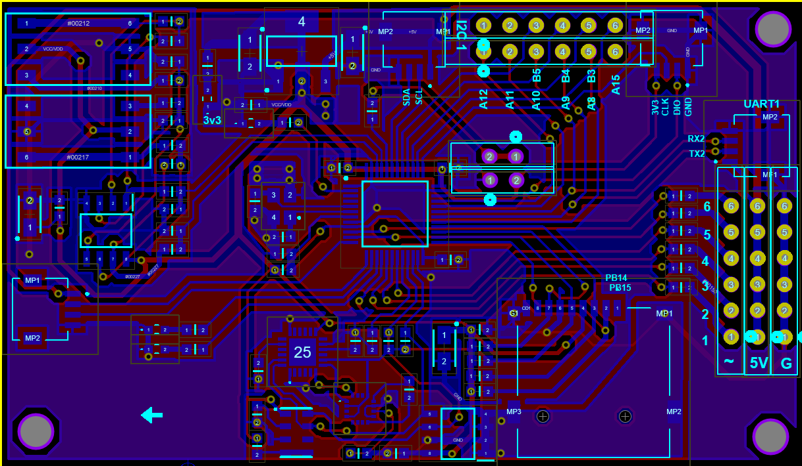
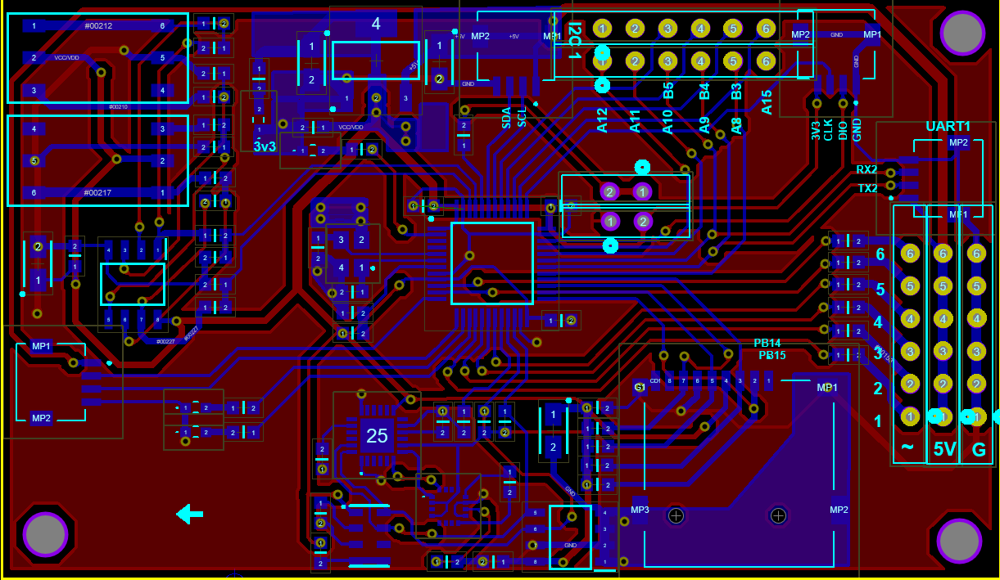
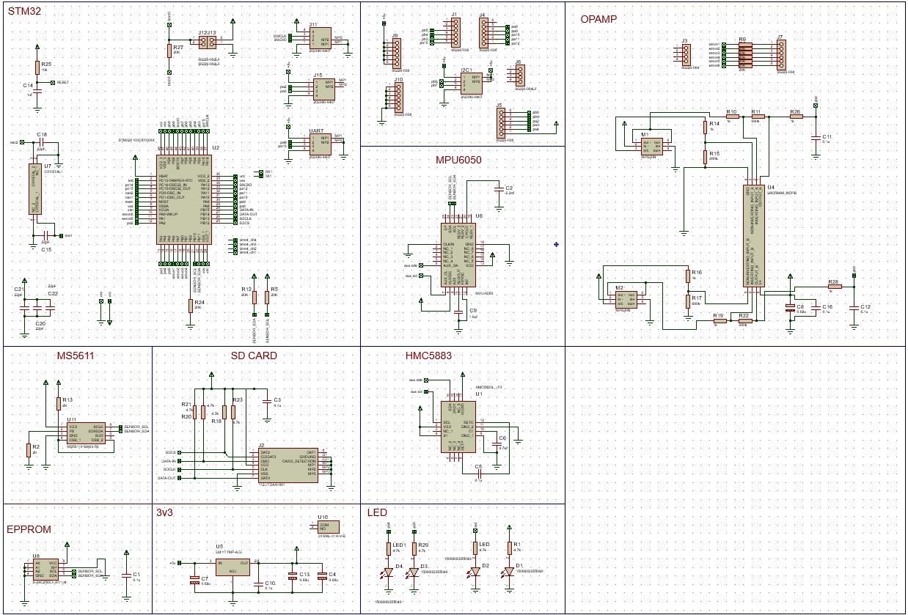

# flight controller v1
 Flight controller PCB design

## Hardware
- 5v operation
- 2 port uart
- 1 port I2C
- 6 pin PWM output
- 9 pin GPIO
- MCU stm32f103c8t6
- mpu-6050
- hmc-5883 magnetic sensor
- ms-5611  baro
- 2x ms40xx pressure sensor for Pitot
- SD card 
- 24HCxx Epprom ic

|                |                |
| ---------------------- | ---------------------- |
|  | |

Schematic

